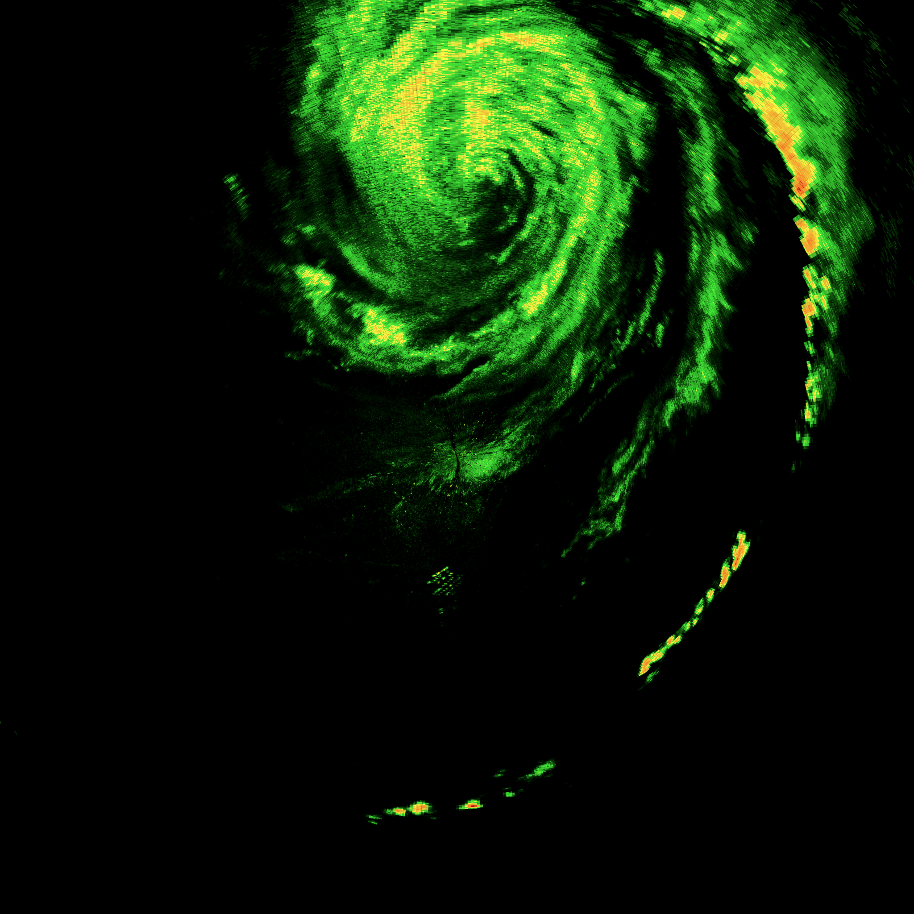

# NEXRAD Level 2 Data Processing

## Resources

## Level 2 Data

> Level II data are sometimes referred to as “base data.” Level II data contain the reflectivity, radial velocity, and spectrum width data produced by the WSR-88D. For sites where the Dual Polarization modification has been completed, the following dual polarization moment data are also included: Differential Reflectivity, Correlation Coefficient, and Differential Phase. **They contain the data from all scans of the radar, at 256 data levels, and at the highest spatial resolution of the radar (1ox 1km for reflectivity, 1ox 0.25 km for radial velocity, and 1o x 0.25 km for spectrum width). At lower elevation angles (generally scans at 1.5o or lower), Super Resolution Data are produced. The difference is that Super Resolution has the following spatial resolution (0.5o x 0.25km for reflectivity, 0.5o x 0.25 km for radial velocity, and 0.5o x 0.25 km for spectrum width). In addition, Super Resolution data contain Doppler data out to a range of 300 km. For more information, go to: http://www.roc.noaa.gov/WSR88D/DualPol/DPLevelII.aspx.**

### WSR-88D: Weather Surveillance Radar, 1988

> The WSR-88D system was developed in the mid to late 1980s. Full scale deployment began in 1992 and was completed in 1995. DoD, DoC, and DoT jointly sponsored the development, acquisition, and deployment of the WSR-88D. There are 159 operating sites which include the RDA and RPG functional areas.

## Glossary

- **RADAR** - RAdio Detection And Ranging
- **NEXRAD**: Next Generation Radar
- **RDA**: Radar Data Acquisition
- **RPG**: Radar Product Generations
- **NetCDF** Network Common Data Form - is a set of software libraries and self-describing, machine-independent data formats that support the creation, access, and sharing of array-oriented scientific data.
- **ICAO** International Civil Aviation Organization

## Resources
- [NOAA - Introduction to Doppler Radar](http://www.srh.noaa.gov/jetstream/doppler/doppler_intro.html) -
-[WSR-88D Govenment Training Course](http://training.weather.gov/wdtd/courses/rac/intro/rda/index.html) - Overview of the WSR-88D Radar and system components.