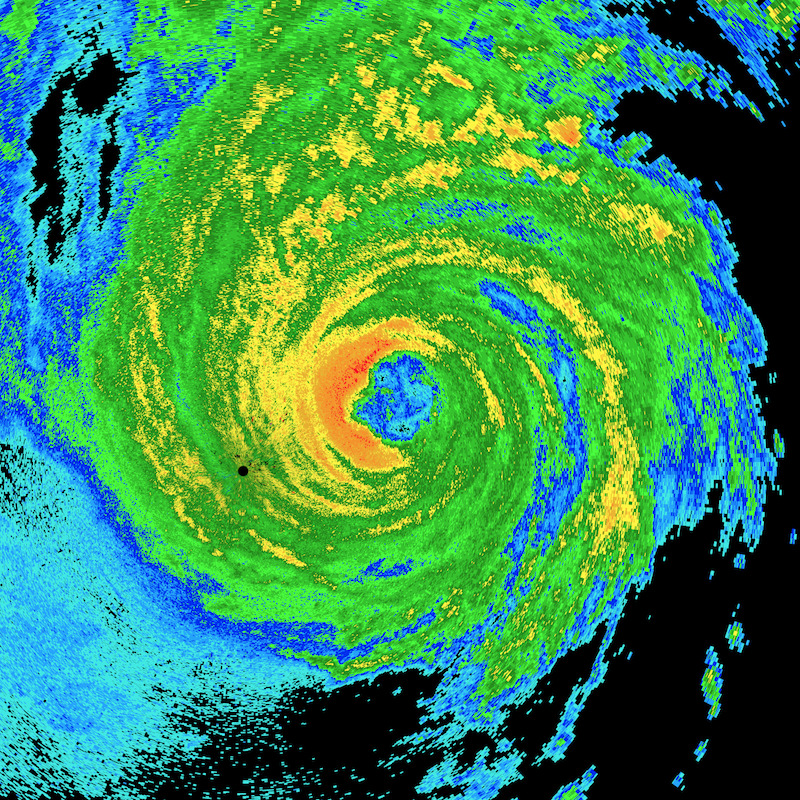

# go-nexrad: NEXRAD Data Processing with Go

Go Tools for processing NEXRAD binary data.

## Features

- NEXRAD Level 2 (Archive II Format) Processing
	- Reflectivity Product Generation
	- Velocity Product Generation

#### Sample Image

Reflectivity Radar for Hurricane Harvey after making landfall from the KCRP (Corpus Christy Radar site).

## Resources

- [NOAA - Introduction to Doppler Radar](http://www.srh.noaa.gov/jetstream/doppler/doppler_intro.html) - Overview of Doppler Radar Technology
- [WSR-88D Govenment Training Course](http://training.weather.gov/wdtd/courses/rac/intro/rda/index.html) - Overview of the WSR-88D Radar and system components.
- [NWS WSR-88D Radar Fundamentals - Slide Deck](https://www.meteor.iastate.edu/classes/mt432/lectures/ISURadarTalk_NWS_2013.pdf) - Kevin Skow National Weather Service, Des Moines, IA
- [AWS S3 NEXRAD Data Browser](https://s3.amazonaws.com/noaa-nexrad-level2/index.html) - Amazon hosted NEXRAD data.
- [GCP Cloud Storage Console - NEXRAD Data Browser](https://console.cloud.google.com/storage/browser/gcp-public-data-nexrad-l2/) - Google hosted NEXRAD data.
